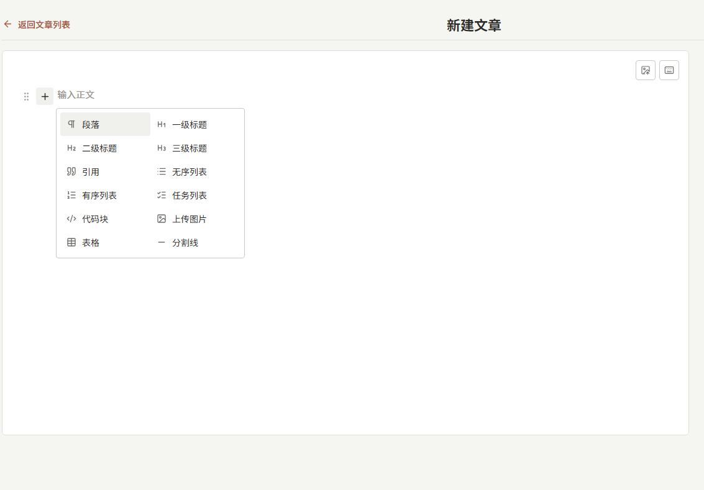

<div align="center">

# doc-editor

块状文档编辑器 // Markdown 进出

[](./LICENSE)
[](https://react.dev/)
[](https://www.typescriptlang.org/)

</div>

## 项目简介

`doc-editor` 是一个可嵌入的 React 文档编辑器。写作时按块操作，对外只交换 Markdown 字符串，方便存进数据库、Git 或任何文本字段。

适合后台、CMS、笔记和内容工具。编辑器不管登录、存储和上传接口，接入方自己接保存与图床。

## 展示

<p align="center">
  
</p>

块工具条、文字格式、表格和图片裁剪都在编辑区内完成。

## 核心能力

| 模块 | 说明 |
| --- | --- |
| 受控文档 | `value` / `onChange` 只走 Markdown，可随时回显原文。 |
| 块编辑 | 段落、标题、引用、有序/无序/任务列表、代码、图片、表格、分割线。 |
| 工具条 | 块操作、行内格式、表格、图片对齐与宽度。 |
| 图片 | 选文件、裁剪、重裁、替换、alt。GIF 保留动画，不裁剪。 |
| 上传边界 | 编辑器只产出本地 `ImageDraft`，由接入方上传并把预览 URL 换成线上地址。 |
| 主题 | CSS 变量，可覆盖颜色和圆角。 |

当前不支持粘贴或拖入图片。

## 快速开始

包尚未发布到 npm，可从本地目录安装：

```bash
npm install file:../doc-editor
```

需要 `react` 与 `react-dom` `>= 18`。

```tsx
import { useState } from 'react'
import { DocumentEditor } from 'doc-editor'
import 'doc-editor/style.css'

export function App() {
  const [doc, setDoc] = useState('# Hello\n\n开始写正文。')

  return (
    <DocumentEditor value={doc} onChange={setDoc} placeholder="输入正文" />
  )
}
```

不传图片相关 props 也可以写文字。插入的图片会使用 `blob:` 预览地址，刷新后失效。

本地调试：

```bash
npm install
npm run dev
```

## 图片

编辑器负责选图、裁剪和预览。接入方负责上传，并把文档里的预览 URL 换成线上地址。

支持 JPG、JPEG、PNG、WebP、GIF。

```tsx
import { useCallback, useState } from 'react'
import {
  DocumentEditor,
  releaseImageDraft,
  type ImageDraft,
} from 'doc-editor'
import 'doc-editor/style.css'

export function App() {
  const [doc, setDoc] = useState('')
  const [drafts, setDrafts] = useState(() => new Map<string, ImageDraft>())

  const onImageDraftCreate = useCallback((draft: ImageDraft) => {
    setDrafts((current) => new Map(current).set(draft.previewUrl, draft))
  }, [])

  const onImageDraftRelease = useCallback((previewUrl: string) => {
    setDrafts((current) => {
      const draft = current.get(previewUrl)
      if (draft) releaseImageDraft(draft)
      const next = new Map(current)
      next.delete(previewUrl)
      return next
    })
  }, [])

  const save = async () => {
    let next = doc
    for (const draft of drafts.values()) {
      const url = await upload(draft.uploadBlob)
      next = next.replaceAll(draft.previewUrl, url)
      releaseImageDraft(draft)
    }
    setDrafts(new Map())
    setDoc(next)
    await persist(next)
  }

  return (
    <DocumentEditor
      value={doc}
      onChange={setDoc}
      imageDrafts={drafts}
      onImageDraftCreate={onImageDraftCreate}
      onImageDraftRelease={onImageDraftRelease}
      onSaveShortcut={() => void save()}
    />
  )
}

async function upload(blob: Blob): Promise<string> {
  return URL.createObjectURL(blob)
}

async function persist(_doc: string) {}
```

草稿被替换、删除或页面卸载时调用 `releaseImageDraft`，避免泄漏 object URL。

`ImageDraft`：

| 字段 | 说明 |
| --- | --- |
| `id` | 草稿 id |
| `originalFile` | 用户选中的原文件 |
| `uploadBlob` | 待上传内容（裁剪后的静态图，或 GIF 原文件） |
| `previewUrl` | 插入文档的 object URL |
| `type` | `'static'` 或 `'gif'` |
| `alt` | 可选 |

## API

### `<DocumentEditor />`

| Prop | Type | Default | Description |
| --- | --- | --- | --- |
| `value` | `string` | required | 文档 Markdown |
| `onChange` | `(value: string) => void` | required | 文档变化 |
| `readOnly` | `boolean` | `false` | 只读 |
| `disabled` | `boolean` | `false` | 禁用编辑和图片操作 |
| `placeholder` | `string` | `'输入正文'` | 空文档占位 |
| `className` | `string` | | 根节点 class |
| `onSaveShortcut` | `() => void` | | `Ctrl+S` / `Cmd+S` |
| `imageDrafts` | `ReadonlyMap<string, ImageDraft>` | `new Map()` | 以 `previewUrl` 为 key 的草稿表 |
| `onImageDraftCreate` | `(draft: ImageDraft) => void` | | 裁剪或确认 GIF 后 |
| `onImageDraftRelease` | `(previewUrl: string) => void` | | 图片被替换或删除时 |

### Helpers

```ts
createImageDraft(file: File, uploadBlob?: Blob, alt?: string): ImageDraft
getImageDraftUrl(draft: ImageDraft): string
releaseImageDraft(draft: ImageDraft): void
releaseAllImageDrafts(drafts: ImageDraft[]): void
```

输入输出是 Markdown（含 GFM 表格）。图片对齐和宽度会写成 HTML：

```html
<p style="text-align:center"></p>
```

行内支持加粗、斜体、下划线、删除线、链接，以及白名单内的文字色 / 背景色。

## 主题

引入 `doc-editor/style.css` 后覆盖 CSS 变量：

```css
:root {
  --color-primary: #292826;
  --color-accent: #a7543a;
  --color-text: #2b2a28;
  --color-text-muted: #706d68;
  --color-surface: #ffffff;
  --color-border: #dfded9;
  --color-danger: #b63b3b;
  --radius-md: 4px;
}
```

完整变量见 [`src/styles/variables.css`](./src/styles/variables.css)。

## 快捷键

| Keys | Action |
| --- | --- |
| `Ctrl+S` | `onSaveShortcut` |
| `Ctrl+Z` / `Ctrl+Shift+Z` / `Ctrl+Y` | 撤销 / 重做 |
| `Ctrl+B` / `I` / `U` | 加粗 / 斜体 / 下划线 |
| `Ctrl+Shift+X` | 删除线 |
| `Ctrl+K` | 链接 |
| `Alt+↑` / `Alt+↓` | 移动当前块 |
| `Enter` | 按光标拆分块 |
| `Shift+Enter` | 块内换行 |
| `Tab` / `Shift+Tab` | 列表缩进或表格单元格 |
| `Esc` | 关闭浮层 |

编辑器内可打开快捷键抽屉查看完整列表。

## 开发

```bash
npm install
npm run dev        # playground
npm run test:run
npm run typecheck
npm run lint
npm run build
```

## 许可证

[MIT](./LICENSE)
